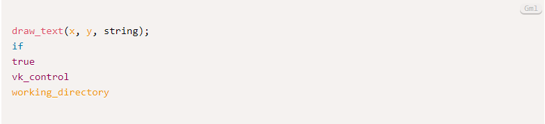

# prism-gml
GameMaker Language Highlighting with Prism.js

## Usage

Include the JS file into `prism.js` 

## Example

```html
<pre>
<code class="language-gml">
draw_text(x, y, string);
if
true
vk_control
working_directory
</code>
</pre>
```

## Result

